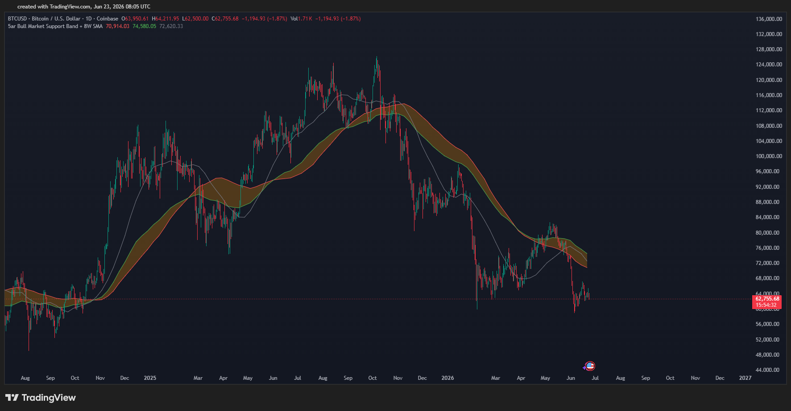
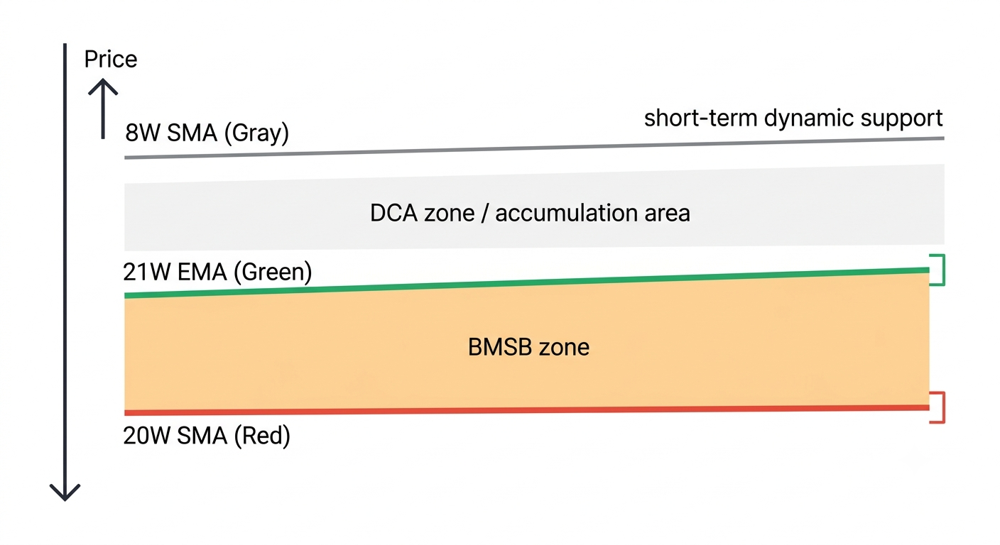
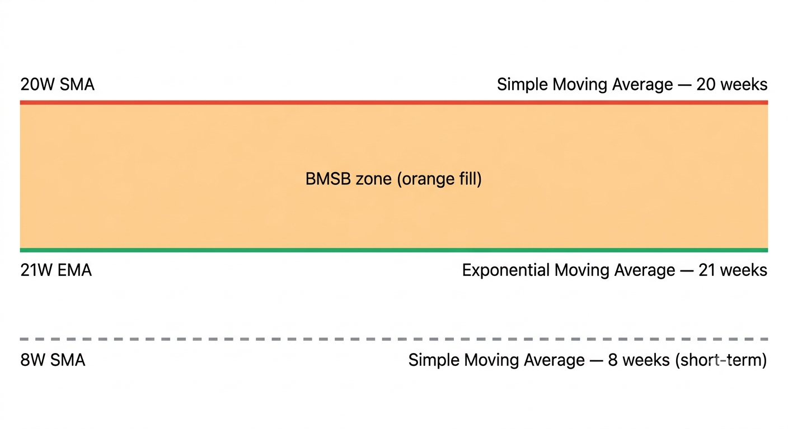
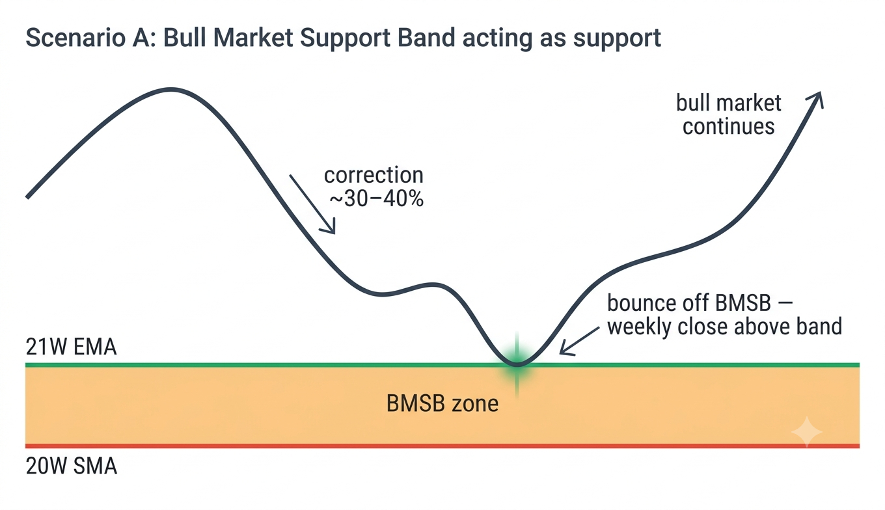
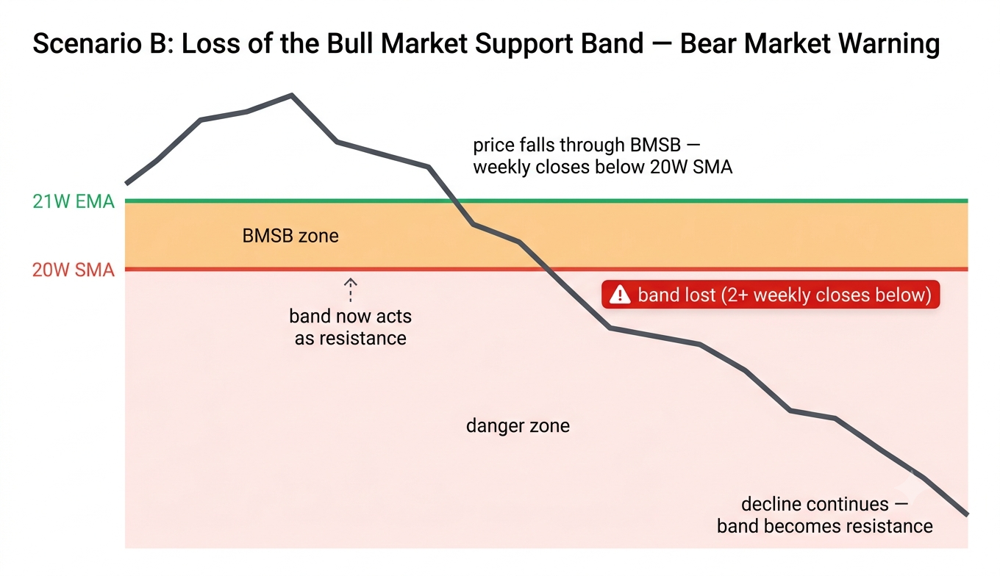
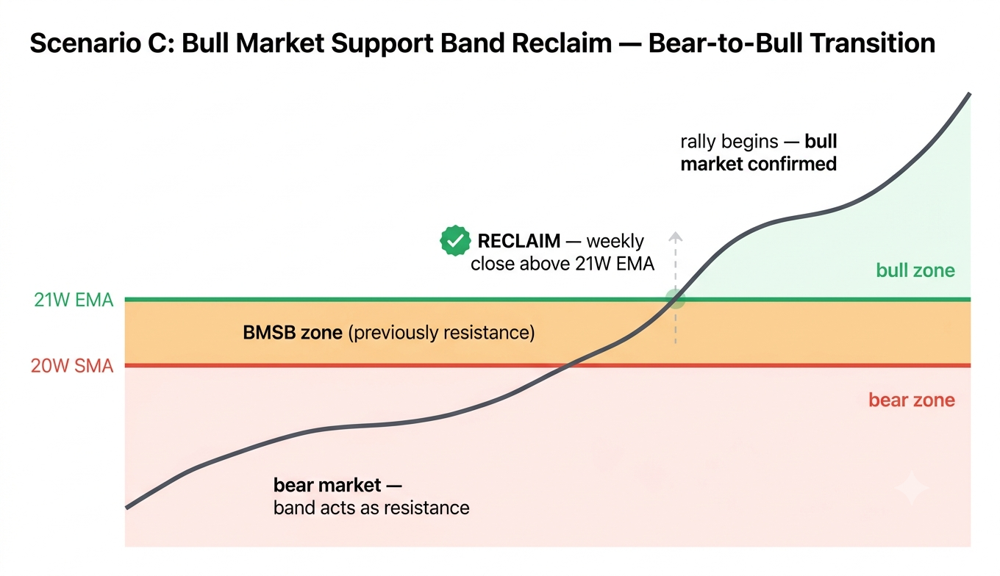

# Bull Market Support Band + 8W SMA [by Domar Ćećo] — Upute za korištenje

> **Pine Script v6 indikator za TradingView**
> Iscrtava klasični Bull Market Support Band (20w SMA + 21w EMA) populariziran od strane Benjamina Cowena, uz dodatak 8-tjednog SMA-a kao kratkoročnog filtera trenda — sve na tjednom timeframeu, vidljivo na bilo kojem TF.

---

## Sadržaj

1. [Što je Bull Market Support Band?](#što-je-bull-market-support-band)
2. [Što dodaje 8W SMA?](#što-dodaje-8w-sma)
3. [Instalacija](#instalacija)
4. [Vizualni elementi na grafikonu](#vizualni-elementi-na-grafikonu)
5. [BMSB kao indikator — čitanje signala](#bmsb-kao-indikator--čitanje-signala)
6. [BMSB kao strategija — pravila ulaza i izlaza](#bmsb-kao-strategija--pravila-ulaza-i-izlaza)
7. [Primjeri setupa](#primjeri-setupa)
8. [Kombiniranje s ostalim alatima](#kombiniranje-s-ostalim-alatima)
9. [Česte greške i savjeti](#česte-greške-i-savjeti)

---

## Što je Bull Market Support Band?



**Bull Market Support Band (BMSB)** je makro-trendni indikator kojeg je popularizirao kvantitativni analitičar **Benjamin Cowen** (*Into The Cryptoverse*). Sastoji se od dvaju tjednih prosjeka:

```
20W SMA  = Simple Moving Average zadnjih 20 tjednih cjenovnih zatvaranja
21W EMA  = Exponential Moving Average zadnjih 21 tjednih cjenovnih zatvaranja
```

Zona između ova dva prosjeka — narandžasto osjenčano područje na grafikonu — jest **"Support Band"**: dinamična zona podrške u bull marketu i zona otpora u bear marketu.

### Zašto baš 20W SMA i 21W EMA?

Ova kombinacija obuhvaća otprilike **5 kalendarskih mjeseci** tjednih zatvora. Dovoljno je dugo da filtrira kratkoročni šum, a dovoljno kratko da reagira na srednji trend. EMA daje nešto veću težinu recentnijim tjednima, pa se band lagano širi ili sužava ovisno o tome koliko brzo cijena napreduje ili pada.

### Zašto je BMSB važan?

Kroz sve prethodne Bitcoin cikluse ova zona je bila **ključno bojno polje između bika i medvjeda**:

- U bull marketu cijena se vraća na band i odbija ga **prema gore** — band funkcionira kao podrška
- U bear marketu cijena naraste do banda i odbija se **prema dolje** — band se pretvara u otpor
- **Reklam (Povrat razine)** (zatvaranje tjedne svjećice iznad banda) = potvrda nastavka bika
- **Gubitak** banda (zatvaranje tjedne svjećice ispod banda) = upozorenje — moguća promjena trenda

| Ciklus | Ponašanje BMSB-a |
|---|---|
| **2017** | BTC korigirao 30–40% prema bandu više puta, ali nikad nije izgubio band tjednim zatvorom — bik je nastavio |
| **2018–2019** | Band postaje otpor — svaki rali se zaustavljao na bandu, bear market nastavio sve niže |
| **2020** | BTC reclaimed band nakon COVID crashe vratio — pokrenuo se bull run do $64k |
| **2021** | Gubitak banda u svibnju → bear market faza; drugi val do $69k je zadnji put vidio band kao podršku |
| **2022–2023** | Band otpor sve do prvog tjednog zatvora iznad → rali 2023/2024 |

---

## Što dodaje 8W SMA?

**8-tjedni SMA** (siva linija) pokriva otprilike **2 kalendarska mjeseca** tjednih zatvora — znatno kraće od BMSB-a. Njegova uloga je trostruka:

1. **Kratkoročni filter trenda** — kad je 8W SMA iznad BMSB-a, kratkoročni i dugoročni trend su usklađeni (jak bull). Kad 8W SMA padne ispod BMSB-a, kratkoročni trend slabi i to je rani signal opreza.
2. **Dinamična podrška unutar bull marketa** — u snažnim trendovima cijena se može odbiti od 8W SMA i *nikada* doseći BMSB (bik je toliko jak da ne dozvoljava dublje korekcije).
3. **Prva linija obrane** — u zoni između 8W SMA i BMSB-a nalaze se potencijalne zone za DCA/akumulaciju unutar makro bull marketa.


```
Redosljed linija odozgo prema dolje (jak bull market):

 ▲  Cijena
 │
 ├── 8W SMA  (siva)       ← kratkoročna dinamička podrška
 │
 ├── 21W EMA (zelena)     ┐
 │                         ├ BMSB zona (narandžasta ispuna)
 ├── 20W SMA (crvena)     ┘
 │
 ▼
```


---

## Instalacija

1. Otvori **TradingView** u pregledniku
2. Na dnu ekrana klikni na **Pine Editor** tab
3. Kopiraj cijeli sadržaj fajla `01_Bull_Market_Support_Band___8W_SMA__by_Domar_Ćećo_.pine`
4. Zalijepiti u Pine Editor (izbriši postojeći sadržaj)
5. Klikni **Save** (disketa ikona) → daj ime indikatoru (npr. `BMSB + 8W`)
6. Klikni **Add to chart**

Indikator je sada aktivan na grafikonu.

> **Preporučeni timeframeovi:** `1D · 3D · 1W`
> Indikator kalkulira sve prosjeke na **tjednom timeframeu** bez obzira koji TF pregledaš, zahvaljujući `timeframe="W"` parametru. Na timeframeovima nižim od dnevnog linije postaju pregrube za praktičnu upotrebu.
>
> **Važno:** Zbog `timeframe_gaps=true` (zadano u Pine Scriptu) plot funkcija spaja tjedne vrijednosti dijagonalno, što daje glatke linije bez stepenica na intraday TF-ovima.


---

## Vizualni elementi na grafikonu

```
         20W SMA ─── crvena linija  ───────────────────────────────────────
        ░░░░░░░░░░░░░░ NARANDŽASTA ISPUNA (BMSB zona) ░░░░░░░░░░░░░░░░░░░░
         21W EMA ─── zelena linija  ───────────────────────────────────────

         8W SMA  ─── siva linija    ─  ─  ─  ─  ─  ─  ─  ─  ─  ─  ─  ─
```


| Element | Boja | Linewidth | Opis |
|---|---|---|---|
| **20W SMA** | 🔴 Crvena | 2 | Duži prosjek (spor, stabilan) |
| **21W EMA** | 🟢 Zelena | 2 | Kraći eksponencijalni prosjek (malo brži) |
| **BMSB zona** | 🟠 Narandžasta (75% transparentno) | — | Ispuna između 20W SMA i 21W EMA |
| **8W SMA** | ⚫ Siva | 1 | Kratkoročni tjedni prosjek |

> 💡 **Savjet:** Na tjednom (1W) timeframeu linije su najčišće i najlakše za čitanje. Na dnevnom (1D) timeframeu dobivaš isti prikaz uz bolju granularnost svjećica za pronalazak ulaza.

---

## BMSB kao indikator — čitanje signala

### Osnovno čitanje (Makro bias)

| Pozicija cijene | Značenje |
|---|---|
| Cijena **iznad** BMSB-a, band raste | Makro bull market — kupci su na vlasti |
| Cijena **unutar** BMSB-a | Zona odluke — band se testira, ishod nije jasnog |
| Cijena **ispod** BMSB-a | Makro bear market ili korekcija — prodavači dominiraju |
| Band **postaje otpor** (cijena se odbija odozdo) | Potvrda bear marketa sve dok nema reklama |

> ⚠️ **Ključno pravilo (prema Ben Cowenu):** Jedino tjedni zatvori ispod ili iznad banda su bitni — intraday i tjedni *wickovi* kroz band se ne računaju kao reklam ni gubitak. Cijena može probiti band wickom, ali ako se tjedna svjećica zatvori s druge strane, signal nije potvrđen.


---

### Scenarij A — Band kao podrška (Bull market nastavak)

```
  Cijena
   ▲
   │    ╭──────────────────────────────────── raste dalje
   │   ╱
   │  ╱  ← odbijanje od BMSB-a, tjedni zatvori iznad banda
   │ ╱
   ├──────── 21W EMA (zelena)   ┐
   │░░░░░░░░░░░░░░░░░░░░░░░░░░░├ BMSB zona
   ├──────── 20W SMA (crvena)  ┘
```


Ovo je **klasični bull market setup** koji je Ben Cowen opisivao za cikluse 2017 i 2020–2021. Cijena korigira prema bandu, formira se reakcija i bull market nastavlja. U 2017. god. BTC je ovako korigirao 30–40% prema bandu višestruko, a svaki put je odbio gore.

**Što tražiš:**
- Tjedna svjećica dotakne gornji rub BMSB-a ili uđe u zonu
- Tjedni zatvor ostaje **iznad** donjeg ruba banda (20W SMA)
- Sljedeće tjedne svjećice kreću prema gore


---

### Scenarij B — Gubitak banda (Upozorenje / Bear market)

```
  Cijena
   ▲
   │  ╲  ← cijena pada kroz band, tjedni zatvori ispod 20W SMA
   │   ╲
   ├──────── 21W EMA (zelena)   ┐
   │░░░░░░░░░░░░░░░░░░░░░░░░░░░├ BMSB zona
   ├──────── 20W SMA (crvena)  ┘
   │    ╲
   │     ╲_____________________________ pad nastavlja
```


**Što to znači:**
- Jedan tjedni zatvor ispod banda = upozorenje, ali nije potvrda
- **Dva ili više uzastopnih tjednih zatvora ispod banda** = potvrda gubitka supporta → bear market / dublja korekcija
- Band se sada ponaša kao **otpor**: rali prema bandu je potencijalna short zona


---

### Scenarij C — Reklam banda (Bear-to-Bull prijelaz)

```
  Cijena
   │     ╭────────────── rali nastavlja iznad banda
   │    ╱
   ├──────── 21W EMA (zelena)   ┐
   │░░░░░░░░░░░░░░░░░░░░░░░░░░░├ BMSB zona (prethodno otpor)
   ├──────── 20W SMA (crvena)  ┘
   │   ↑
   │ tjedni zatvor iznad = reklam!
```


**Što tražiš:**
- BTC je bio ispod banda tjednima/mjesecima
- Tjedna svjećica se zatvori **iznad gornjeg ruba** (21W EMA)
- Idući tjedan ostaje iznad → potvrđeni reklam

Historijsko: svaki put kad je BTC reklamovao band nakon produženog boravka ispod njega (2019., 2023., 2025.), slijedili su raliji od 50% ili više u narednim mjesecima.

---

### Uloga 8W SMA u čitanju signala

| Pozicija 8W SMA | Značenje |
|---|---|
| 8W SMA **daleko iznad** BMSB-a | Snažan bull trend — kratkoročna i dugoročna dinamika su usklađene |
| 8W SMA **pada prema** BMSB-u | Kratkoročni momentum slabi — oprez, moguće testiranje banda |
| 8W SMA **ispod** BMSB-a, cijena iznad | Kratkoročna slabost unutar bull marketa — moguće zdravo testiranje |
| 8W SMA **ispod** BMSB-a, cijena ispod | Potvrda slabosti — kratkoročno i dugoročno su oboje bearish |

---

## BMSB kao strategija — pravila ulaza i izlaza

### Strategija 1 — BMSB Bounce (Makro akumulacija)

Tražimo **odbijanje cijene od BMSB zone** u kontekstu potvrđenog makro bull marketa.

**Uvjeti za LONG (akumulacija):**
1. Makro kontekst: prethodni tjedni zatvori bili su iznad BMSB-a (bull market potvrđen)
2. Cijena korigira i ulazi u BMSB zonu ili dotakne 20W SMA
3. Tjedna svjećica se **zatvori iznad** donjeg ruba BMSB-a (20W SMA) — nije izgubila band
4. 8W SMA još uvijek iznad ili unutar BMSB-a (kratkoročni trend nije potpuno slomljen)

**Ulaz:** Na tjednom zatvorenom baru koji potvrđuje odbijanje / prvih dana sljedeće tjedne svjećice

**Stop Loss:** Tjedni zatvor ispod 20W SMA (gubitak banda = exit)

**Take Profit:**
- TP1: Prethodni lokalni vrh
- TP2: Prodaja u tranšama kako cijena napreduje, praćenjem risk metrika (npr. Ben Cowenov Risk Score)

---

### Strategija 2 — Reklam (Bear-to-Bull prijelaz)

Tražimo **potvrđeni reklam** BMSB-a nakon produženog boravka ispod njega.

**Uvjeti za LONG:**
1. BTC je bio ispod BMSB-a minimalno 4+ tjedna
2. Tjedna svjećica se zatvori iznad **obje linije** (i 20W SMA i 21W EMA)
3. Sljedeći tjedan ne vraća se odmah ispod banda (nema false reklama)
4. 8W SMA počinje okretati prema gore i konvergira prema BMSB-u

**Ulaz:** Konzervativno — čekaj potvrdu drugog tjednog zatvora iznad banda. Agresivno — ulaz odmah po prvom reklamu.

**Stop Loss:** Tjedni zatvor ispod 20W SMA (lažni reklam)

**Take Profit:** Nema fiksnog TP — prati trend. Izlaz prema risk metrici ili gubitku 8W SMA-a odozgo.

> ⚠️ Oprez: u bear marketima znaju se pojaviti **lažni reklami** — cijena nakratko prođe iznad banda, ali se brzo vrati ispod. Uvijek čekaj minimalno dva uzastopna tjedna zatvora iznad.

---

### Strategija 3 — Gubitak banda kao izlaz / short signal

Tražimo **potvrđeni gubitak** BMSB-a kao signal za smanjenje pozicije ili short ulaz.

**Uvjeti:**
1. BTC je bio iznad BMSB-a (bull market u tijeku)
2. Tjedna svjećica se zatvori ispod **donjeg ruba** (20W SMA)
3. Sljedeći tjedan ne reclaima — band potvrđen kao otpor

**Akcija:**
- Dugoročni hodleri: razmatranje smanjenja pozicije ili zaštite hedgeom
- Aktivni traderi: kratka short pozicija s targetom prema dnu prethodnog ciklusa / 200W SMA-u

**Stop Loss za short:** Tjedni zatvor iznad 21W EMA (reklam)

---

## Primjeri setupa

### Primjer 1 — Klasični bull market bounce (BTC/USDT, 1W chart)

```
Kontekst:  BTC/USDT, tjedni chart, Q3 2024
BMSB zona: ~$55.000 – $57.000
8W SMA:    ~$60.000

Tjedan 1:  BTC pada s $72k prema BMSB-u — ulazi u zonu
Tjedan 2:  Tjedna svjećica: wick ispod 20W SMA, ali zatvor IZNAD 21W EMA
Tjedan 3:  Svjećica zelena, BTC se diže iznad $60k

Ulaz:   Ulaz na zatvorenom tjednom baru (Tjedan 3) ~$60.500
SL:     Tjedni zatvor ispod 20W SMA (~$54.500) → rizik ~$6.000
TP1:    Prethodni vrh ~$72.000  →  R:R ≈ 1:2
TP2:    Nastavak praćenja trenda iznad 8W SMA
```

---

### Primjer 2 — Reklam banda (BTC/USDT, 1W chart)

```
Kontekst:  BTC/USDT, tjedni chart, Q1 2023
BMSB zona: ~$23.000 – $25.000
8W SMA:    ~$22.000 (ispod BMSB-a, slabost)

Više tjedana:  BTC ispod BMSB-a, band otpor
Tjedan 0:  BTC se diže, tjedni zatvor NA bandu ~$23.500 (nije potvrda)
Tjedan 1:  Zatvor iznad obje linije, ~$25.100 → REKLAM potvrđen
Tjedan 2:  Ostaje iznad, 8W SMA okrenuo gore → potvrda

Ulaz:   ~$25.200 (zatvor Tjedan 2, potvrda)
SL:     Tjedni zatvor ispod 20W SMA (~$22.500)
TP:     Bez fiksnog targeta — praćenje band-a sve do gubitka ~$69.000+
```

---

### Primjer 3 — Gubitak banda kao exit signal (BTC/USDT, 1W chart)

```
Kontekst:  BTC/USDT, tjedni chart, kraj 2021
BMSB zona: ~$47.000 – $49.000
Prethodni ATH: $69.000

Tjedan 1:  BTC pada s $69k, ulazi u BMSB
Tjedan 2:  Tjedni zatvor ispod 20W SMA ~$47.000 → upozorenje
Tjedan 3:  Nema reklama — band je otpor

Akcija:   Smanjenje pozicije / exit dijela longova na reklam-bandu
SL za long: Tjedni zatvor ispod 20W SMA (već se dogodio — exit)
Rezultat:  BTC nastavio pad prema $15.000 u 2022.
```

---

## Kombiniranje s ostalim alatima

BMSB + 8W SMA funkcionira **optimalno u kombinaciji** s:

| Alat | Kako kombinirati |
|---|---|
| **200W SMA** | Ultimativna makro podrška po Ben Cowenu — ako BMSB izgubljen, 200W SMA je sljedeći ključni level |
| **50W SMA** | Ben Cowen: "Nekoliko tjednih zatvora ispod 50W SMA = ciklus možda gotov" — dodaje dubinu analize ispod BMSB-a |
| **RSI (tjedni, 14)** | RSI iznad 50 + reklam BMSB-a = snažna potvrda. RSI ispod 50 pri reklamu = oprez od lažnog reklama |
| **Volumen** | Reklam s volumenom iznad prosjeka = snažniji signal. Reklam na niskom volumenu = sumnjiviji |
| **Bitcoin Dominance** | Cowen: rastu BTC dominancije u bear marketima → alts krvare. BMSB gledati na BTC, ne na altcoinima |
| **Risk Score (ITC)** | Ben Cowenov Risk Score 0–1: BMSB bounce na niskom riscu (< 0.3) = optimalna akumulacijska zona |
| **Logaritamske regresijske trake** | Širi ciklični okvir u koji BMSB pristaje — BMSB je unutar ciklusa, regresijske trake su makro okvir |

> 💡 **Pravilo confluencne:** BMSB sam po sebi je snažan signal, ali najkvalitetniji setupe nastaju kada se bounce ili reklam poklapa s više faktora — npr. BMSB + tjedni RSI iznad 50 + rastući volumen + nizak risk score.

---

## Česte greške i savjeti

### ❌ Greške koje treba izbjegavati

**1. Brojiš wickove, a ne zatvore**
Cijena može probiti band wickom i odmah se vratiti. Jedino tjedni *zatvori* iznad/ispod banda su relevantni. Wick kroz band nije ni gubitak ni reklam.

**2. Gledaš BMSB na intraday timeframeu**
Indikator je dizajniran za **makro analizu na tjednim zatvorima**. Koristiti ga na 15m ili 1H za kratkoročne signale nema smisla — signal je tjedni, ne intraday.

**3. Jedan tjedni zatvor ispod banda = potvrđeni bear market**
Jedan tjedni zatvor ispod banda je upozorenje, ne potvrda. Trebaju minimalno **dva uzastopna tjedna zatvora** ispod banda za potvrdu.

**4. Zanemaruješ 8W SMA**
8W SMA ti govori koliko brzo se kratkoročni trend mijenja. Ako 8W SMA već tjednima pada prema BMSB-u, korekcija nije iznenađenje. Prati ga kao rani warning signal.

**5. Koristiš BMSB na altcoinima umjesto na Bitcoinu**
Ben Cowen razvio je BMSB primarno za **Bitcoin**. Altcoinima dominiraju BTC/ETH parovi i makro ciklusi — BMSB na altovima može davati lažne signale jer alti imaju drukčiju volatilnost i cikliku.

**6. Ignoriraš makro kontekst**
BMSB je makro alat. U jeku rasta kamatnih stopa, jak dolar, risk-off okruženje — čak i odbijanje od bandu može biti lažno. Uvijek gledaj širi makro okvir.

---

### ✅ Savjeti za bolje rezultate

- **Tjedni chart je tvoj primarni ekran** za BMSB analizu. Dnevni koristiš samo da nađeš precizni ulaz/izlaz unutar tjednog signala
- **Prati Ben Cowenov YouTube kanal** (*@intothecryptoverse*) — redovito objavljuje "Bitcoin: Bull Market Support Band" videa s najnovijim čitanjem banda
- Postavi **Alert** na TradingView na 20W SMA liniji da te upozori kada cijenska svjećica dotakne razinu — ne moraš stalno gledati grafikon
- **Ne trguj altcoine samo na bazi BTC BMSB-a** — ako BTC odbije od banda, alti mogu i dalje padati (BTC dominancija može rasti čak i kad BTC ide gore)
- Kombiniraj BMSB s **Into The Cryptoverse Risk Score** (besplatna osnovna verzija dostupna na intothecryptoverse.com) za određivanje veličine pozicije: veća pozicija na niskom riscu (< 0.3), manji ulazi na visokom riscu (> 0.7)
- Vodi **trading journal**: bilježi svaki tjedan je li BMSB podrška, otpor ili se testira — s vremenom ćeš razviti intuiciju za faze ciklusa

---

## Brza referenca — Cheat Sheet

```
BULL MARKET SUPPORT BAND + 8W SMA

Linije:
🔴 20W SMA  }
🟢 21W EMA  } → BMSB zona (narandžasta ispuna)
⚫ 8W SMA   → kratkoročni tjedni prosjek

Pozicija cijene:
Cijena iznad BMSB + 8W SMA iznad BMSB  → Snažan bull market
Cijena testira BMSB, tjedni zatvor iznad → Band drži, bull nastavlja
Tjedni zatvor ispod BMSB (2+ tjedna)   → Upozorenje, bear market

Ključna pravila (po Ben Cowenu):
✅ Reklam  = tjedni zatvor IZNAD 21W EMA (bika potvr.)
❌ Gubitak = tjedni zatvor ISPOD 20W SMA (2+ tjedna)
⚠️ Wickovi ne računaju — samo tjedni zatvori!

Uloga 8W SMA:
8W SMA >> BMSB  → jak bull momentum
8W SMA → BMSB  → kratkoročno slabi, prati pažljivo
8W SMA < BMSB  → kratkoročno bearish, BMSB na testu

Historijsko:
2017 → Višestruki bounceovi od BMSB-a, bik nastavio
2018 → Band flippan u otpor → bear market
2020 → Reklam post-COVID crash → rali do $64k
2021 → Gubitak banda → bear market 2022
2023 → Reklam → rali do $73k
```

---

*Indikator je napisan u Pine Script v6 i testiran na TradingView platformi.
BMSB koncept popularizirao je Benjamin Cowen (Into The Cryptoverse). Implementacija i 8W SMA dodatak: Domar Ćećo.
Indikator nije financijski savjet — svaki trade nosi rizik gubitka kapitala.*
