# 📊 TradingView Alati — Postavke i Konfiguracija [by Domar Ćećo]

> Prilagođene boje i konfiguracije za TradingView drawing alate. Sustav boja je osmišljen za maksimalnu preglednost i dosljednost na tamnoj pozadini grafikona.

---

## 📋 Sadržaj

| # | Alat | Shortcut |
|---|------|----------|
| 1 | [Horizontal Ray](#horizontal-ray) | `Alt + J` ⭐ |
| 2 | [Rectangle](#rectangle) | `Alt + Shift + R` ⭐ |
| 3 | [Fixed Range Volume Profile](#fixed-range-volume-profile) | ⭐ |
| 4 | [Fib Speed Resistance Fan](#fib-speed-resistance-fan) | ⭐ |
| 5 | [Trend-Based Fib Extension](#trend-based-fib-extension) | ⭐ |
| 6 | [Fibonacci Retracement](#fibonacci-retracement) | `Alt + F` ⭐ |

**Fibonacci predlošci:**

| # | Naziv predloška |
|---|----------------|
| 01 | [Golden Pocket Zone](#01-golden-pocket-zone) |
| 02 | [Standard](#02-standard) |
| 03 | [Fib Expansion](#03-fib-expansion) |
| 04 | [GZ](#04-gz) |
| 05 | [Negative Fibonacci](#05-negative-fibonacci) |
| 06 | [Range Fib](#06-range-fib) |
| 07 | [EQ Equilibrium](#07-eq-equilibrium) |
| 08 | [Fib 0.25](#08-fib-025) |
| 09 | [Fib 0.5](#09-fib-05) |
| 10 | [Mini Fibs](#10-mini-fibs) |
| 11 | [Scalp](#11-scalp) |
| 12 | [Gann Fib](#12-gann-fib) |

---

## Horizontal Ray

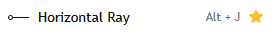

**Predlošci:** `D` · `W` · `M` · `Key` · `SFP` · `Daily Open` · `Yesterday Median`

Horizontalni zrak koji se proteže beskonačno u desno od definirane cijenove razine. Koristi se za obilježavanje ključnih statičnih razina tržišta: dnevno otvaranje (`Daily Open`), tjedna i mjesečna razina, medijana prethodnog dana (`Yesterday Median`) te SFP zona. Svaki predložak dobiva prepoznatljivu boju za brzo vizualno snalaženje na grafikonu.

**Strategija:** Kada cijena pristupi Weekly razini (žuta) ili Monthly razini (narančasta), promatraj price action potvrdu — pinbar, engulfing svjećnjak ili odmak od razine. `SFP` (ljubičasta) označava prostor lažnog proboja prethodnog swinga s povratkom unutar range-a, što signalizira potencijalni reversal. `Key` razina (bijela) naglašava institucijsko relevantne razine ručno postavljene od strane analizara.

 

| Naziv predloška | HEX | Preview |
|----------------|-----|---------|
| Yesterday Median | `#5b9cf6` | 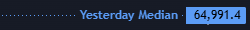 |
| Daily Open | `#00bcd4` | 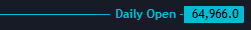 |
| Daily Level | `#00bcd4` | 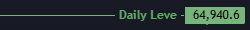 |
| Weekly Level | `#ffee58` | 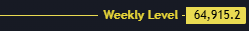 |
| Monthly Level | `#f57c00` | 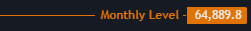 |
| Key | `#ffffff` | 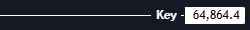 |
| SFP | `#9c27b0` | 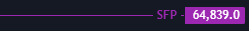 |

---

## Rectangle

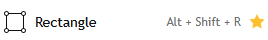

**Predlošci:** `Initial Balance` · `G` · `R`

Pravokutnik koji vizualno obilježava cjenovni raspon. Koristi se za **Initial Balance (IB)** — raspon prvih 60 minuta trgovanja (ključno u Auction Market Theory), te za **G (Bullish)** i **R (Bearish)** zone koje vizualno označavaju demand i supply zone. Svaki predložak posjeduje tri zasebno podesiva elementa: Border, Middle line i Background, pri čemu je prozirnost (%) precizno kalibrirana za čitljivost.

**Strategija:** Initial Balance definira rane kupce i prodavače sesije. Proboj IB High-a sugerira bullish sentiment za ostatak dana, proboj IB Low-a bearish. Srednja linija IB (IBMID) djeluje kao zona ravnoteže — cijena često potražuje IBMID kao target. `G` zona se crta na demand / support područjima, `R` zona na supply / resistance područjima za brz vizualni pregled ključnih zonama na grafikonu.

 

| Predložak | Border | Middle Line | Background | Preview |
|-----------|--------|-------------|------------|---------|
| G — Bullish | `#4caf50` &nbsp;  &nbsp; 100% | — | `#4caf50` &nbsp;  &nbsp; 20% | 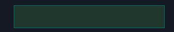 |
| R — Bearish | `#801922` &nbsp;  &nbsp; 100% | — | `#801922` &nbsp;  &nbsp; 20% | 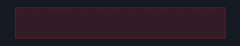 |
| Initial Balance | `#3179f5` &nbsp;  &nbsp; 56% | `#3179f5` &nbsp;  &nbsp; 100% | `#3179f5` &nbsp;  &nbsp; 7% | 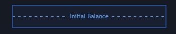 |

---

## Fixed Range Volume Profile

**Postavke:** `Row Size: 100` · `Value Area Volume: 68%`

Fixed Range Volume Profile prikazuje raspodjelu volumena unutar ručno odabranog cjenovnog raspona. Vizualizira gdje se odvijala najveća aktivnost kupaca i prodavača u prošlosti. **POC (Point of Control)** je cijena s apsolutno najvećim prometom — najvažnija razina profila. **Value Area** (68% ukupnog volumena) definira zonu u kojoj je odrađena "fer vrijednost" tržišta.

**Strategija:** VAH (Value Area High) i VAL (Value Area Low) su rubovi vrijednosne zone i djeluju kao ključni support/resistance. Cijena koja ulazi u Value Area odozgo ima tendenciju putovati prema POC-u i dalje prema VAL-u. `High Volume Nodes (HVN)` — zadebljani barovi — su zone gdje će cijena usporiti ili se konsolidirati. `Low Volume Nodes (LVN)` — tanki barovi — su zone brzog prolaza bez zadržavanja.

 

<table>
<tr>
<td width="50%" align="center">

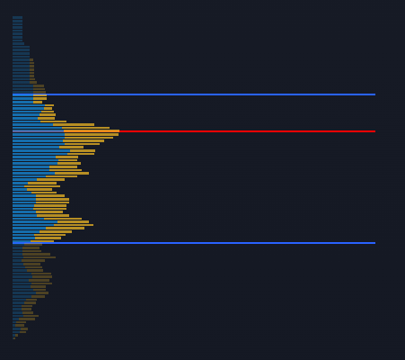

</td>
<td width="50%" valign="top">

| Element | HEX | % | Naziv |
|---------|-----|---|-------|
| VAL / VAH | `#2962ff` &nbsp;  | 100% | Plava |
| POC | `#ff0000` &nbsp;  | 100% | Crvena |
| Value Area Down | `#fbc02d` &nbsp;  | 70% | Žuta |
| Value Area Up | `#1592e6` &nbsp;  | 70% | Plava |
| Down Volume | `#fbc123` &nbsp;  | 24% | Žuta |
| Up Volume | `#1592e6` &nbsp;  | 24% | Plava |

</td>
</tr>
</table>

---

## Fib Speed Resistance Fan

**Napomena:** `Right labels → ON`

Fibonacci Speed Resistance Fan su dijagonalne linije koje se protežu iz jedne točke (pivot) i kombiniraju vremensku (speed) i cjenovnu (resistance) komponentu kretanja. Za razliku od horizontalnih Fibonacci razina koje su statične, fan linije su **dinamične** i mijenjaju svoju cjenovnu vrijednost s protokom vremena. Posebno su korisne za identifikaciju kuta trenda i dinamičnih support/resistance razina.

**Strategija:** Nacrtaj fan iz značajnog dna (za uzlazni trend) ili vrha (za silazni trend). Linije `0.382`, `0.5` i `0.618` su najvažnije i najčešće djeluju kao zone reakcije. Dok cijena drži određenu fan liniju, trend se smatra aktivnim. Proboj `0.5` fan linije prema dolje (u uzlaznom trendu) sugerira slabljenje momenta i potencijalnu promjenu karaktera tržišta. Kombiniraj s horizontalnim Fibonacci razinama za dodatnu konfluenciju (konvergenciju razina).

 

<table>
<tr>
<td width="50%" align="center">

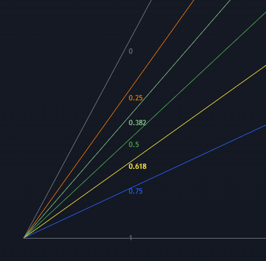

</td>
<td width="50%" valign="top">

| Level | HEX | Naziv |
|-------|-----|-------|
| 0 / 1 | `#808080` &nbsp;  | Siva |
| 0.25 | `#f57c00` &nbsp;  | Narančasta |
| 0.382 | `#81c784` &nbsp;  | Svjetlo Zelena |
| 0.5 | `#4caf50` &nbsp;  | Zelena |
| 0.618 | `#ffeb3b` &nbsp;  | Žuta |
| 0.75 | `#2962ff` &nbsp;  | Plava |

</td>
</tr>
</table>

---

## Trend-Based Fib Extension

**Napomena:** `Levels → Values`

Trend-Based Fib Extension koristi **tri točke (A → B → C)** za projekciju budućih cjenovnih ciljeva izvan granica originalnog impulsa. Za razliku od standardnog Fibonacci Retracements koji mjeri korekciju unutar poteza, Extension mjeri **nastavak trenda** ili kompletiranje harmoničnih uzoraka. Ovo je primarni alat za postavljanje price targetova.

**Strategija:** Točka A je početak impulsa, B je vrhunac impulsa, C je kraj korekcije. Razina `1.618` — Zlatni rez (Golden Ratio) — je statistički najpouzdaniji primarni price target. Razina `2.0` je sekundarni target, a `2.618` je ekstremna projekcija koja se dostiže kod snažnih trendova. Alat je nezamjenjiv u Elliott Wave analizi (za projekciju 3. i 5. vala), harmoničnim patternima (Gartley, Butterfly, Crab) te u ICT konceptima za identifikaciju FTE (Fibonacci Time & Extension) zona.

 

<table>
<tr>
<td width="50%" align="center">

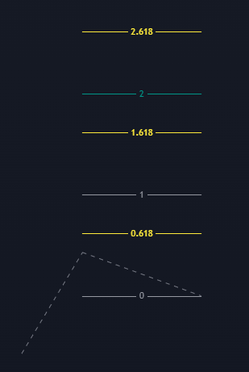

</td>
<td width="50%" valign="top">

| Level | HEX | Naziv |
|-------|-----|-------|
| 0 / 1 | `#9598a1` &nbsp;  | Siva |
| 1.618 | `#ffeb3b` &nbsp;  | Žuta |
| 2 | `#009688` &nbsp;  | Zelena |
| 2.618 | `#ffeb3b` &nbsp;  | Žuta |

</td>
</tr>
</table>

---

## Fibonacci Retracement

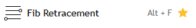

Fibonacci Retracement je temeljni alat tehničke analize koji mjeri koliko je cijena "povukla" od prethodnog impulsa. Temelji se na matematičkim omjerima deriviranim iz Fibonaccijevog niza (23.6%, 38.2%, 50%, 61.8%, 78.6%) koji se ponavljaju u prirodi i financijskim tržištima. Alatom se vuče **od dna prema vrhu** za bullish setup ili **od vrha prema dnu** za bearish setup. Ovaj repozitorij sadrži **12 precizno konfiguriranih predložaka** za različite situacije i strategije.

> 💡 **Opće pravilo:** Razine `0.618 – 0.705` čine tzv. **Golden Pocket** — statistički najsnažniji retracement magnet na kojem tržište najčešće nastavlja u smjeru originalnog trenda.

---

### 01 Golden Pocket Zone

Ključni predložak za identifikaciju **Golden Pocket zone** (razine 0.618 – 0.705) — najjačeg retracement magneta u tehničkoj analizi. Zona je vizualno istaknuta trima nijansama žute boje (puna, 59% i 32% prozirnosti) za jasno obilježavanje "džepa". Negativne razine (-0.234, -0.616, -0.99) projiciraju extension targetove s iste Fibonacci vučene mreže bez potrebe za dodatnim alatom.

**Strategija:** U uzlaznom trendu, čekaj povlačenje cijene u Golden Pocket (između 0.618 i 0.705). Tamo traži price action potvrdu (pinbar, BOS/CHoCH na manjem timeframeu) za long entry s uskim stop-lossom ispod razine 0.79. Primarni targetovi su negativne razine: `-0.234`, `-0.616` i `-0.99` koje odgovaraju Fibonacci Extension projekcijama.

<table>
<tr>
<td width="50%" align="center">

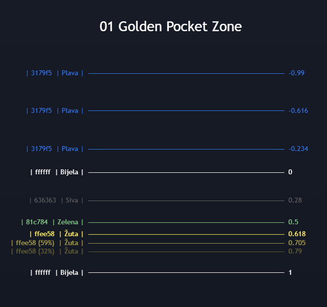

</td>
<td width="50%" valign="top">

| Level | HEX | % | Naziv |
|-------|-----|---|-------|
| 0 / 1 | `#ffffff` &nbsp;  | 100% | Bijela |
| 0.28 | `#636363` &nbsp;  | 100% | Siva |
| 0.5 | `#81c784` &nbsp;  | 100% | Zelena |
| **0.618** | `#ffee58` &nbsp;  | **100%** | **Žuta** |
| 0.705 | `#ffee58` &nbsp;  | 59% | Žuta |
| 0.79 | `#ffee58` &nbsp;  | 32% | Žuta |
| -0.234 | `#3179f5` &nbsp;  | 100% | Plava |
| -0.616 | `#3179f5` &nbsp;  | 100% | Plava |
| -0.99 | `#3179f5` &nbsp;  | 100% | Plava |

</td>
</tr>
</table>

---

### 02 Standard

Standardni Fibonacci Retracement s klasičnim razinama za sveobuhvatnu analizu. Uključuje razinu `0.786` u cijanu — posebno korisnu za harmoničke patterne Gartley i Bat. Razina `0.886` u tamno crvenoj korisna je za dublje harmoničke patterne (Bat, Cypher). Crvena razina `0.236` naglašava plitke korekcije tipične za snažne trendove.

**Strategija:** Koristi ovaj predložak kao početnu točku analize svakog impulsa. U snažnom trendu, plitka korekcija do `0.236`–`0.382` signalizira nastavak trenda — tražiti ulaz na tim razinama. Dublja korekcija do `0.618`–`0.786` nudi bolji risk/reward, ali zahtijeva jaču price action potvrdu. Razina `0.886` je posljednja linija odbrane trenda — proboj sugerira reversal.

<table>
<tr>
<td width="50%" align="center">

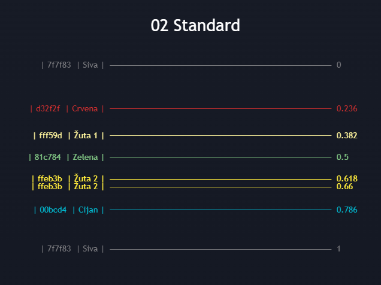

</td>
<td width="50%" valign="top">

| Level | HEX | Naziv |
|-------|-----|-------|
| 0 / 1 | `#7f7f83` &nbsp;  | Siva |
| 0.236 | `#d32f2f` &nbsp;  | Crvena |
| 0.382 | `#fff59d` &nbsp;  | Žuta 1 |
| 0.5 | `#81c784` &nbsp;  | Zelena |
| 0.618 | `#ffeb3b` &nbsp;  | Žuta 2 |
| 0.66 | `#ffeb3b` &nbsp;  | Žuta 2 |
| 0.786 | `#00bcd4` &nbsp;  | Cijan |
| 0.886 | `#b22833` &nbsp;  | Harmonic |

</td>
</tr>
</table>

---

### 03 Fib Expansion

Fibonacci Expansion projekcije unutar impulsa za identifikaciju unutar-valnih targetova. Za razliku od Extension alata (koji projicira *izvan* vala), Expansion mjeri **amplitudu unutar jednog trenda** koristeći samo dvije točke. Idealan za Elliott Wave analizu pri projekciji ciljeva 3. i 5. vala unutar nadređene strukture.

**Strategija:** Razina `1.618` (Zlatni rez, žuta) je primarni i najvažniji target — najsnažniji magnet za cijenu u trendu. Razina `2.0` (zelena) je česta zona konsolidacije ili okretišta, `2.618` (žuta) je ekstremna projekcija za impulzivne trendove. Razine `3.0` i `3.618` su opcionalne i koriste se samo kod iznimno snažnih trendova (npr. kriptovalutni bullrun). Zelene razine (1.133, 2, 3) naglašavaju "Zelene" ciljeve manje snage od Zlatnog reza.

<table>
<tr>
<td width="50%" align="center">

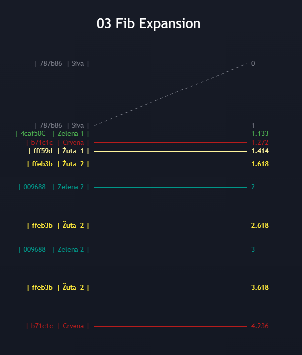

</td>
<td width="50%" valign="top">

| Level | HEX | Napomena |
|-------|-----|----------|
| 0 / 1 | `#787b86` &nbsp;  | Siva |
| 1.133 | `#4caf50` &nbsp;  | Zelena |
| 1.272 | `#b71c1c` &nbsp;  | Crvena |
| 1.414 | `#fff59d` &nbsp;  | Žuta 1 |
| **1.618** | `#ffeb3b` &nbsp;  | **Zlatni rez** |
| 2 | `#009688` &nbsp;  | Zelena |
| 2.618 | `#ffeb3b` &nbsp;  | Žuta |
| 3 | `#009688` &nbsp;  | Zelena *(opcionalno)* |
| 3.618 | `#ffeb3b` &nbsp;  | Žuta *(opcionalno)* |
| 4.236 | `#b71c1c` &nbsp;  | Crvena *(opcionalno)* |

</td>
</tr>
</table>

---

### 04 GZ

Minimalistički predložak koji fokusira pažnju isključivo na **Golden Zone** — uski raspon između `0.618` i `0.72`. Namijenjen brzu identifikaciju ove zone bez vizualnog "šuma" ostalih razina. Plava razina `0.72` označava gornju granicu Golden Zone koja se koristi kao konzervativan ulaz.

**Strategija:** Koristi ovaj predložak kada su razine jasne i nije potrebna detaljna analiza svih retracement nivoa. Idealan za brzu analizu na višim timeframovima (H4, Daily) gdje je samo informacija o Golden Pocket lokaciji dovoljna za donošenje odluke o ulasku. Dvije žute razine (`0.618` i `0.66`) + plava (`0.72`) definiraju precizne ulazne zone za različite stilove ulaska.

<table>
<tr>
<td width="50%" align="center">

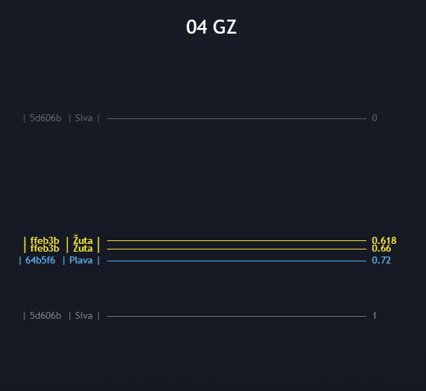

</td>
<td width="50%" valign="top">

| Level | HEX | Naziv |
|-------|-----|-------|
| 0 / 1 | `#5d606b` &nbsp;  | Siva |
| 0.618 | `#ffeb3b` &nbsp;  | Žuta |
| 0.66 | `#ffeb3b` &nbsp;  | Žuta |
| 0.72 | `#64b5f6` &nbsp;  | Plava |

</td>
</tr>
</table>

---

### 05 Negative Fibonacci

Predložak koji prikazuje isključivo **negativne Fibonacci razine** (ispod nule) za projekciju kretanja ispod dna originalnog impulsa (bearish setup) ili iznad vrha (bullish setup). Predstavlja "lošu stranu" Fibonaccija — što se događa kada cijena ne uspije reagirati na standardne razine i probija ključne potpore.

**Strategija:** Koristi ovaj predložak u kombinaciji s Golden Pocket Zone ili Standard predloškom. Kada cijena probije razinu `0` (dno impulsa), negativne razine postaju targetovi: `-0.236` (crvena) je prvi target proboja, `-0.618` (žuta) je snažniji target, `-1.0` (crvena) je projekcija jednaka originalnom impulsu u suprotnom smjeru, `-1.618` je Fibonacci extension target. Posebno korisno za stop-hunt scenarije i identifikaciju razina likvidnosti ispod ključnih lowova.

<table>
<tr>
<td width="50%" align="center">

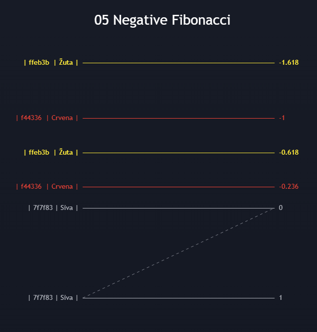

</td>
<td width="50%" valign="top">

| Level | HEX | Naziv |
|-------|-----|-------|
| 0 / 1 | `#7f7f83` &nbsp;  | Siva |
| -0.236 | `#f44336` &nbsp;  | Crvena |
| -0.618 | `#ffeb3b` &nbsp;  | Žuta |
| -1 | `#f44336` &nbsp;  | Crvena |
| -1.618 | `#ffeb3b` &nbsp;  | Žuta |

</td>
</tr>
</table>

---

### 06 Range Fib

Minimalistički predložak s tri sive razine (`0`, `0.5`, `1`) za brzo vizualno obilježavanje raspona i njegovog equilibriuma. Nema boje ni složene razine — čisti prikaz gornje granice, sredine i donje granice odabranog raspona.

**Strategija:** Koristi za obilježavanje raspona određene sesije (azijska, London, New York), tjednog raspona ili raspona važne konsolidacije. Srednja razina (`0.5`) je **equilibrium** — matematički centar raspona koji često djeluje kao magnet i zona ravnoteže između kupaca i prodavača. Cijena koja se nalazi iznad 0.5 sugerira bullish bias unutar raspona; ispod 0.5 bearish bias. Često se kombinira s `07 EQ equilibrium` predloškom.

<table>
<tr>
<td width="50%" align="center">

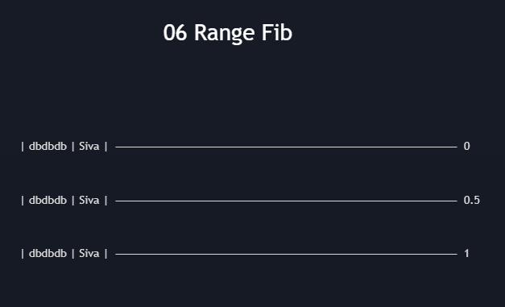

</td>
<td width="50%" valign="top">

| Level | HEX | Naziv |
|-------|-----|-------|
| 0 | `#dbdbdb` &nbsp;  | Siva |
| 0.5 | `#dbdbdb` &nbsp;  | Siva |
| 1 | `#dbdbdb` &nbsp;  | Siva |

</td>
</tr>
</table>

---

### 07 EQ Equilibrium

Predložak s jedinom razinom `0.5` (plava) i aktiviranim `Extend Lines Right` — linija se proteže beskonačno u desno. Uz `Levels ON Percent %` prikazuje razinu kao 50.00%, što je vizualno jasno i odmah čitljivo. Jednostavno, no iznimno korisno za brzo obilježavanje sredine bilo kojeg raspona.

**Strategija:** Equilibrium (EQ) na razini `0.5` je jedna od najvažnijih koncepcija u Auction Market Theory i ICT pristupu. Svaki impulz ima svoju sredinu — i tržište se redovito vraća na tu sredinu pri potrazi za ravnotežom. Koristi ovaj predložak za obilježavanje EQ-a prethodnog tjednog ili dnevnog raspona kao potencijalnog magneta za cijenu. Kada cijena dosegne EQ, promatra se hoće li ga koristiti kao odskočnu dasku ili kao zonu tranzicije prema drugoj polovici raspona.

<table>
<tr>
<td width="50%" align="center">

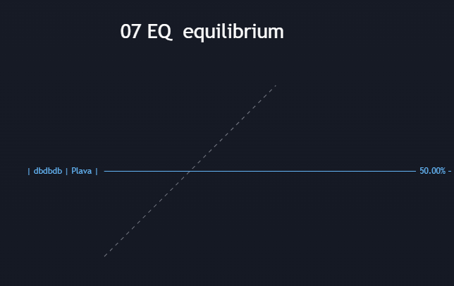

</td>
<td width="50%" valign="top">

| Level | HEX | Naziv |
|-------|-----|-------|
| 0.5 | `#64b5f6` &nbsp;  | Plava |

**Napomene:**
- `libreExtend` → Extend Lines Right
- `Levels ON Percent %`

</td>
</tr>
</table>

---

### 08 Fib 0.25

Predložak s četiri jednako raspoređene razine u koracima od 25% (`0`, `0.25`, `0.5`, `0.75`, `1`) za kvartilnu analizu cjenovnog raspona. Sve razine su iste sive boje za minimalan vizualni šum.

**Strategija:** Neka tržišta i instrumenti pokazuju snažne reakcije na razine 0.25 i 0.75 umjesto standardnih Fibonacci razina. Ovaj predložak koristi za identifikaciju tih "ne-Fibonacci" razina reakcije, posebno na deviznom tržištu (Forex) gdje se okrugle razine cijena i kvartili pokazuju kao snažan support/resistance. Kombinira se s `06 Range Fib` za potvrdu da cijena poštuje kvartilnu strukturu raspona.

<table>
<tr>
<td width="50%" align="center">

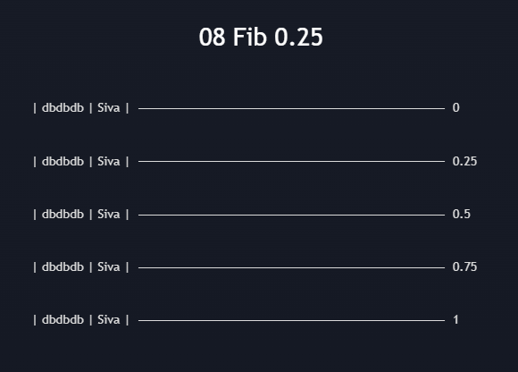

</td>
<td width="50%" valign="top">

| Level | HEX | Naziv |
|-------|-----|-------|
| 0 / 1 | `#dbdbdb` &nbsp;  | Siva |
| 0.25 | `#dbdbdb` &nbsp;  | Siva |
| 0.5 | `#dbdbdb` &nbsp;  | Siva |
| 0.75 | `#dbdbdb` &nbsp;  | Siva |

</td>
</tr>
</table>

---

### 09 Fib 0.5

Predložak koji prikazuje extension razine u koracima od `0.5` u oba smjera — od `+0.5` do `-4.0`. Svrha je vizualizacija višestrukih extension targetova jednakih razmaka koji se nalaze iznad i ispod originalnog raspona. Sve razine su sive za čist, nenametljiv prikaz mreže.

**Strategija:** Koristi za određivanje višestrukih targetova pri snažnim trend kretanjima kada tržište ne poštuje standardne Fibonacci razine. Svaka razina u koraku od 0.5 predstavlja jedan "cjelokupni potez" udaljenosti od originalnog impulsa. Posebno korisno u intraday tradingu za projekciju potencijalnih targetova unutar dana koristeći raniji impuls (npr. otvaranje burze ili proboj IB-a) kao bazu za projekciju.

<table>
<tr>
<td width="50%" align="center">

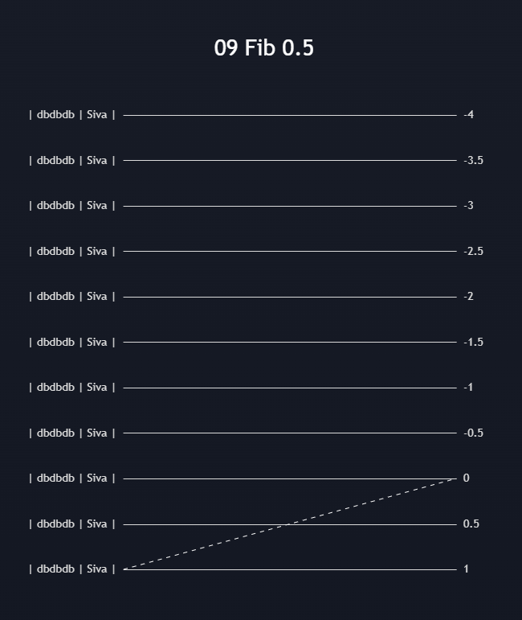

</td>
<td width="50%" valign="top">

| Level | HEX | Naziv |
|-------|-----|-------|
| 0 / 1 | `#dbdbdb` &nbsp;  | Siva |
| 0.5 | `#dbdbdb` &nbsp;  | Siva |
| -0.5 | `#dbdbdb` &nbsp;  | Siva |
| -1 | `#dbdbdb` &nbsp;  | Siva |
| -1.5 | `#dbdbdb` &nbsp;  | Siva |
| -2 | `#dbdbdb` &nbsp;  | Siva |
| -2.5 | `#dbdbdb` &nbsp;  | Siva |
| -3 | `#dbdbdb` &nbsp;  | Siva |
| -3.5 | `#dbdbdb` &nbsp;  | Siva |
| -4 | `#dbdbdb` &nbsp;  | Siva |

</td>
</tr>
</table>

---

### 10 Mini Fibs

Kompletni set Fibonacci razina uključujući sub-razine (`0.125`, `0.875`) i negativne razine (`-0.236`, `-0.382`, `-0.618`, `-0.786`, `-1`). Sve razine su iste sive boje — predložak funkcionira kao **referentna mreža** s minimalnim vizualnim opterećenjem, a analiticar sam identificira koja je razina relevantna u određenom kontekstu.

**Strategija:** Mini Fibs je sveobuhvatna referentna karta svih potencijalnih razina reakcije. Koristi ga za identifikaciju "ne-standardnih" razina gdje tržište neočekivano reagira, posebno `0.125` i `0.875` koji se pojavljuju u tržištima s institucionalnom aktivnošću. Zbog gustoće razina, preporučuje se korištenje na zaslonima visoke rezolucije i pri analizi manjih timeframova (M5–H1) gdje je prostora na grafikonu dovoljno za pregled svih nivoa.

<table>
<tr>
<td width="50%" align="center">

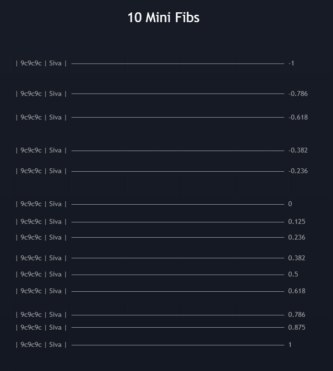

</td>
<td width="50%" valign="top">

| Level | HEX | Naziv |
|-------|-----|-------|
| -1 | `#9c9c9c` &nbsp;  | Siva |
| -0.786 | `#9c9c9c` &nbsp;  | Siva |
| -0.618 | `#9c9c9c` &nbsp;  | Siva |
| -0.382 | `#9c9c9c` &nbsp;  | Siva |
| -0.236 | `#9c9c9c` &nbsp;  | Siva |
| 0 / 1 | `#9c9c9c` &nbsp;  | Siva |
| 0.125 | `#9c9c9c` &nbsp;  | Siva |
| 0.236 | `#9c9c9c` &nbsp;  | Siva |
| 0.382 | `#9c9c9c` &nbsp;  | Siva |
| 0.5 | `#9c9c9c` &nbsp;  | Siva |
| 0.618 | `#9c9c9c` &nbsp;  | Siva |
| 0.786 | `#9c9c9c` &nbsp;  | Siva |
| 0.875 | `#9c9c9c` &nbsp;  | Siva |

</td>
</tr>
</table>

---

### 11 Scalp

Specijalizirani predložak za **skalping** i kratkoročno trgovanje. Vuče se od **zadnjeg predzadnjeg swinga** (0 → 1), a razine se automatski projiciraju s **obje strane** — i iznad i ispod originalnog poteza. Bijele razine (`0` i `1`) označavaju granice impulsa, zelene (`-1` i `2`) su ključni targetovi, a sive razine su međuciljeevi za parcijalni exit.

**Strategija:** Identificiraj zadnji mali swing (predzadnji swing high do zadnjeg swing low ili obrnuto na M1–M15 timeframeu). Povuci Scalp Fib od 0 do 1. Razine `-0.25`, `-0.5`, `-0.75` ispod nule i `1.25`, `1.5`, `1.75` iznad jedan su potencijalni mikro-targetovi za skalp trade. Zelena razina `-1` ispod nule i `2` iznad jedan su primarni targetovi koji odgovaraju jednakom pokretu kao i originalni swing. Posebno efikasno u ranijim satima London i NY sesije kada su swingovi definirani i impulzivni.

<table>
<tr>
<td width="50%" align="center">

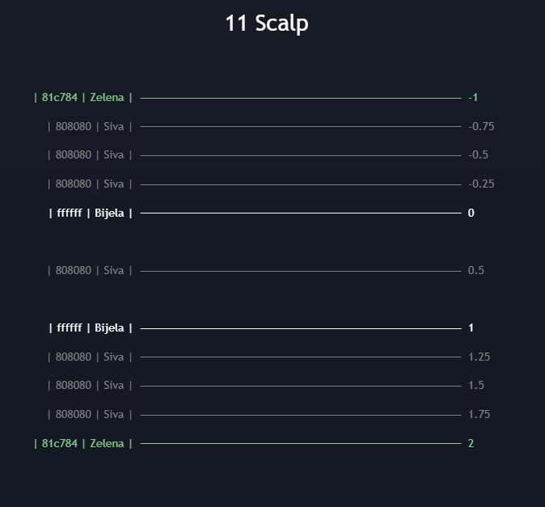

</td>
<td width="50%" valign="top">

| Level | HEX | Naziv |
|-------|-----|-------|
| -1 | `#81c784` &nbsp;  | Zelena |
| -0.75 | `#808080` &nbsp;  | Siva |
| -0.5 | `#808080` &nbsp;  | Siva |
| -0.25 | `#808080` &nbsp;  | Siva |
| 0 / 1 | `#ffffff` &nbsp;  | Bijela |
| 0.5 | `#808080` &nbsp;  | Siva |
| 1.25 | `#808080` &nbsp;  | Siva |
| 1.5 | `#808080` &nbsp;  | Siva |
| 1.75 | `#808080` &nbsp;  | Siva |
| 2 | `#81c784` &nbsp;  | Zelena |

</td>
</tr>
</table>

---

### 12 Gann Fib

Predložak baziran na **Gannovim matematičkim podjelama** koje je koristio William D. Gann za predviđanje cjenovnih razina. Ključne su **osmičke razine** (1/8 = `0.125`, 2/8 = `0.25` itd.) i **trećine** (1/3 = `0.33`, 2/3 = `0.66`) te `0.375` i `0.625` koji odgovaraju 3/8 i 5/8 Gannovog kvadrata. Sive rubne razine (`0` i `1`) označavaju granice impulsa, sve unutarnje razine su bijele za maximalan kontrast.

**Strategija:** Gann je vjerovao da su cijene koje dijele raspon na 8 jednakih dijelova matematički "prirodne" razine ravnoteže. U praksi, `0.5` (4/8) je i dalje najvažnija — to je Gannov "pola od raspona" koji smatrao ključnim za svaku analizu. `0.375` (3/8) i `0.625` (5/8) su Gannove specifičnosti koje nadopunjuju standardne Fibonacci razine — cijena koja probije 5/8 razinu pokazuje snažnu tendenciju dosizanja 6/8 (`0.75`) i dalje. Ovaj predložak je komplementaran standardnom Fibonacci pristupu i može se koristiti paralelno za traženje konfluencija Fibonacci i Gann razina.

<table>
<tr>
<td width="50%" align="center">

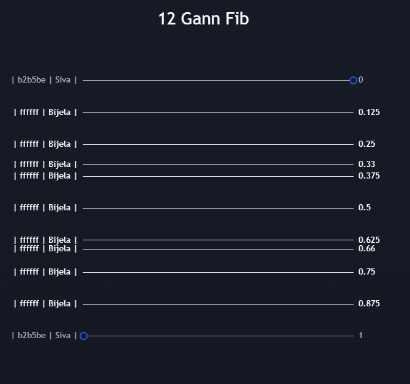

</td>
<td width="50%" valign="top">

| Level | HEX | Naziv |
|-------|-----|-------|
| 0 / 1 | `#b2b5be` &nbsp;  | Siva |
| 0.125 | `#ffffff` &nbsp;  | Bijela |
| 0.25 | `#ffffff` &nbsp;  | Bijela |
| 0.33 | `#ffffff` &nbsp;  | Bijela |
| 0.375 | `#ffffff` &nbsp;  | Bijela |
| 0.5 | `#ffffff` &nbsp;  | Bijela |
| 0.625 | `#ffffff` &nbsp;  | Bijela |
| 0.66 | `#ffffff` &nbsp;  | Bijela |
| 0.75 | `#ffffff` &nbsp;  | Bijela |
| 0.875 | `#ffffff` &nbsp;  | Bijela |

</td>
</tr>
</table>

---

*Sve postavke su optimizirane za tamnu pozadinu TradingView grafikona.*

